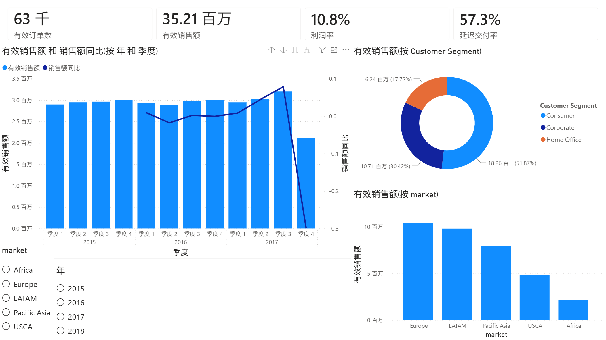
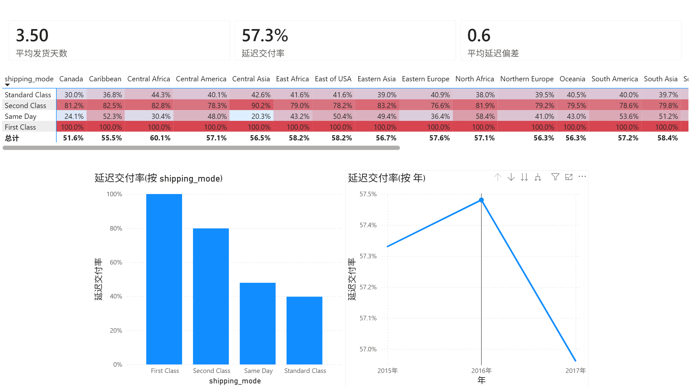
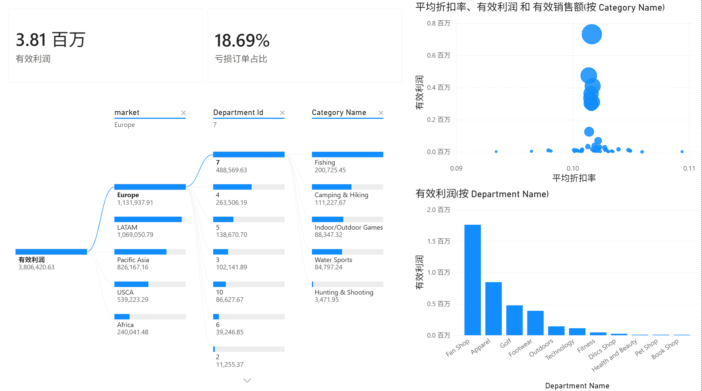
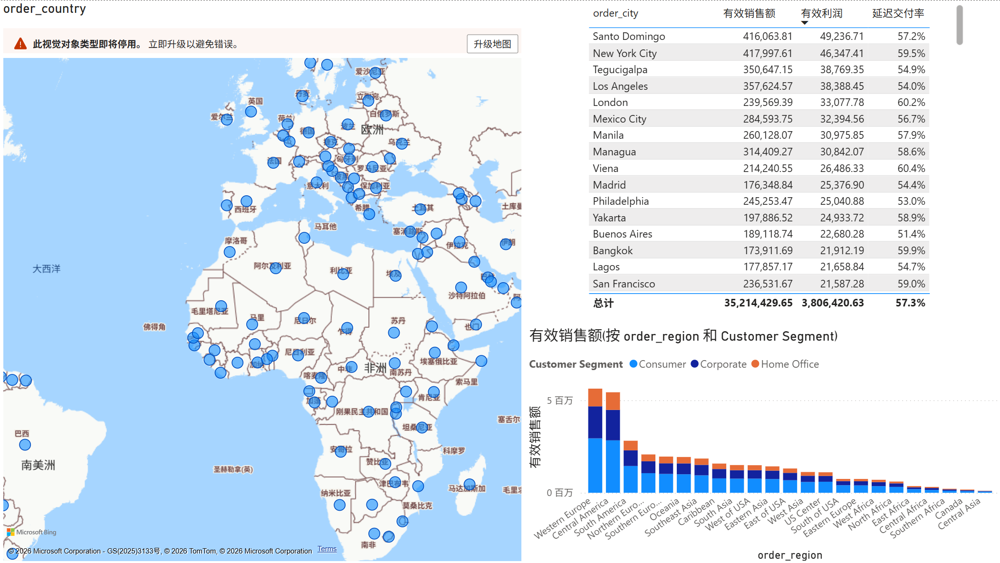

# DataCo 供应链经营分析看板（Power BI）

[](https://github.com/MimiJimmy001/dataco-smart-supply-chain/actions/workflows/ci.yml)
[](SupplyChain-Dashboard.pbix)
[](LICENSE)

基于 Kaggle DataCo Smart Supply Chain 公开数据集（180,519 条订单明细、2015-2018 三年），
完成从数据清洗、星型模型建模到 Power BI 交互式看板的全流程经营分析，覆盖
**经营总览、交付绩效、品类利润、区域市场** 四大主题。

## 项目内容导航

- [可视化与可解释性](docs/VISUAL_GUIDE.md)：4 个以上 Mermaid 思维导图、流程图和指标解释

- [项目案例研究](docs/CASE_STUDY.md)：业务问题、星型模型、四页看板、核心结论和面试讲解
- [看板设计方案](docs/dashboard_design.md)：页面结构、视觉对象和交互设计
- [DAX 度量值](dax/measures.dax)：指标口径与时间智能定义
## 数据说明

| 项 | 说明 |
|----|------|
| 来源 | [Kaggle: DataCo Smart Supply Chain for Big Data Analysis](https://www.kaggle.com/datasets/shashwatwork/dataco-smart-supply-chain-for-big-data-analysis) |
| 规模 | 180,519 行 × 53 列，订单明细级 |
| 跨度 | 2015-01 ~ 2018-01 |
| 覆盖 | 62,897 张订单、20,261 名客户、118 种产品、5 大市场 |

## 快速开始

```bash
pip install -r requirements.txt
python prepare_data.py        # 清洗 + 星型建模, 输出 data/processed/ 四张表
```

然后在 Power BI Desktop 中：

1. **获取数据 → CSV**：导入 `data/processed/` 下 `fact_order_items`、`dim_date`、
   `dim_customer`、`dim_product` 四张表
2. **模型视图**建关系（见 `docs/dashboard_design.md`）
3. 按 `dax/measures.dax` 逐条新建度量值
4. 按 `docs/dashboard_design.md` 搭建 4 页看板

## 数据建模

```
dim_date[date]             1 ─── *  fact_order_items[order_date]
dim_customer[Customer Id]  1 ─── *  fact_order_items[customer_id]
dim_product[Product Card Id] 1 ── * fact_order_items[product_id]
```

清洗规则：剔除 PII 列（Email/密码/地址/姓名等 9 列）；解析订单与发货日期；
衍生发货偏差（实际天数 - 计划天数）与取消标记；销售/利润口径剔除取消与欺诈订单，
交付绩效单独口径。

## 看板预览

| 经营总览 | 交付绩效 |
|---------|---------|
|  |  |

| 品类与利润 | 区域市场 |
|-----------|---------|
|  |  |

## 核心发现

- **规模**：三年总销售额 $35.2M、利润 $3.8M（利润率 10.8%），
  平均客单价约 $560
- **交付**：延迟交付率 57.2%；**First Class 延迟率 100%、Second Class 79.5%**，
  而 Standard 仅 39.6%，高等级运输的承诺时效与实际产能严重错配
- **市场**：Europe（$10.4M）、LATAM（$9.8M）、Pacific Asia（$7.9M）为三大主力
  市场，合计占比 80%
- **品类**：Fan Shop 部门贡献 $16.4M（46.5%），Apparel $7.6M 次之
- **亏损**：亏损订单占比 18.7%，且在各部门间均匀分布（17.6%~18.9%），
  指向全局定价与折扣策略问题而非单一品类
- **客户**：Consumer 客群贡献 52% 销售额，Corporate 30%，Home Office 18%

## 目录结构

```
├── prepare_data.py           # 清洗 + 星型建模脚本(可复现)
├── data/
│   ├── raw/                  # 原始数据集(需自行下载)
│   └── processed/            # 星型模型四表(Power BI 直接导入)
├── dax/
│   └── measures.dax          # 全部 DAX 度量值定义
└── docs/
    └── dashboard_design.md   # 4 页看板视觉设计方案
```

## 技术栈

Python (Pandas) · Power BI Desktop · DAX · 星型数据模型
