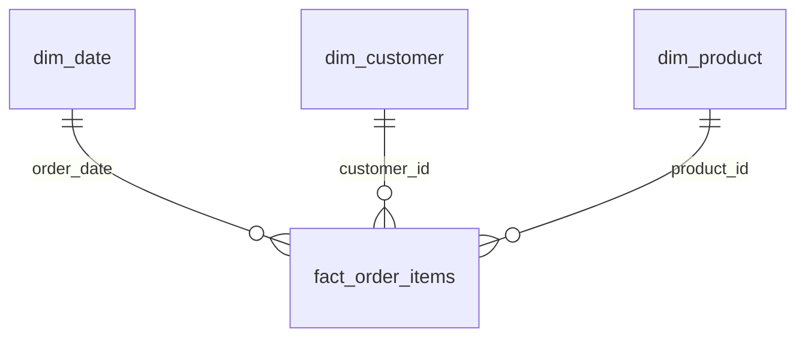

# 项目案例研究：DataCo 供应链经营分析看板

## 一、业务问题

供应链经营分析不能只看销售额。订单是否按时交付、哪些品类在亏损、不同市场之间的收入结构如何、折扣是否真正带来利润，都是经营决策必须回答的问题。

本项目使用 Kaggle DataCo 公开数据集的 180,519 条订单明细，将原始宽表转化为事实表和维度表，再用 Power BI 搭建经营总览、交付绩效、品类利润和区域市场四个主题页面。

## 二、数据规模与处理链路

| 项目 | 数值 |
|---|---|
| 数据规模 | 180,519 行 × 53 列 |
| 时间范围 | 2015-01 至 2018-01 |
| 订单数 | 62,897 |
| 客户数 | 20,261 |
| 产品数 | 118 |
| 市场数 | 5 |

ETL 过程位于 `prepare_data.py`：

1. 读取原始 CSV，并删除邮箱、密码、地址、姓名等 PII 字段。
2. 解析订单日期和发货日期，派生年份、季度、月份、星期等日期属性。
3. 计算实际发货天数与计划发货天数的偏差。
4. 标记取消/欺诈订单和延迟订单。
5. 输出 `fact_order_items`、`dim_date`、`dim_customer`、`dim_product` 四张表。

## 三、星型模型

指标口径单独处理：

- 销售额、利润和客单价剔除取消及欺诈订单。
- 交付绩效只统计已发货订单。
- 品类利润按商品明细口径计算，避免订单级金额在多商品订单中重复累加。
- `order_day` 使用纯日期，确保可以和 `dim_date` 建立关系。

## 四、四页看板

### 1. 经营总览

展示有效销售额、有效利润、利润率、有效订单数和平均客单价，并通过月度趋势、市场排名、客户 Segment 占比和年份/市场筛选器形成经营全貌。

### 2. 交付绩效

这是项目的核心业务故事。用运输方式 × 区域矩阵、延迟率排名、月度趋势和地图展示交付问题，并进一步分析计划时效与实际产能的错配。

### 3. 品类与利润

通过分解树查看市场 → 部门 → 品类的利润结构；使用折扣率与利润散点图识别亏损区间，并展示 Top/Bottom 产品利润。

### 4. 区域市场

展示销售额地图、区域 × Segment 结构、Top 城市和三大市场的收入对比。

## 五、核心结果与解释

### 经营规模

- 总销售额约 $35.2M，总利润约 $3.8M，整体利润率 10.8%。
- 平均客单价约 $560。
- Europe、LATAM、Pacific Asia 合计贡献约 80% 销售额。

### 交付表现

- 延迟交付率约 57.2%，说明交付问题是系统性的，而不只是个别区域。
- First Class 延迟率为 100%，Second Class 为 79.5%，Standard 为 39.6%。
- 这组现象不支持“运费等级越高履约越好”的直觉，反而说明承诺时效和实际运输能力存在错配。

### 利润结构

- Fan Shop 部门销售额约 $16.4M，占整体约 46.5%；Apparel 约 $7.6M。
- 亏损订单占比约 18.7%，且各部门在 17.6%–18.9% 之间分布。
- 亏损并未集中在某个单一部门，说明应优先检查全局定价、折扣和成本策略，而不是只优化某个品类。

## 六、关键设计决策

- **先建模再画图**：日期、客户、产品拆成维度表，避免在 Power BI 中直接对宽表硬编码各种关系。
- **统一指标口径**：取消订单、交付订单和亏损订单使用不同过滤条件，并由 DAX 度量值集中管理。
- **用业务问题组织页面**：不是堆叠图表，而是围绕经营、交付、利润和市场形成连续叙事。
- **保留 PBIX 成品**：原始数据不随仓库提交，但看板文件、DAX、设计文档和四页截图均可直接查看。

## 七、当前边界

- 数据集时间范围为 2015–2018，不能直接代表当前供应链环境。
- 这是描述性分析和业务假设，不是因果推断；“延迟与运输方式相关”不等于证明运输方式造成延迟。
- Power BI 页面截图和 PBIX 是主要交付物，刷新后的数据结果取决于用户导入的原始 CSV。
- 原始数据需要从 Kaggle 下载，仓库只提供处理脚本和数据模型设计。

## 八、面试讲解框架

### 为什么必须先做星型模型？

如果直接在 53 列宽表上做筛选和时间智能，关系容易混乱，日期同比也会失效。日期、客户、产品独立后，指标可以围绕统一维度复用，并让交付绩效和销售口径相互隔离。

### 为什么 First Class 延迟率反而最高？

结果反映的是数据中的承诺时效与实际履约能力错配。分析结果不直接推断运营原因，但可以据此提出检查运输等级设定、承诺时效和承运商产能的业务假设。

### 如何避免“图表很多但没有结论”？

每个页面必须围绕一个决策问题：经营总览回答规模和结构，交付页回答履约瓶颈，利润页回答亏损来源，市场页回答区域资源分配。图表只是证据，结论和行动建议才是报告的核心。

## 九、简历可复用表述

- 使用 Python/Pandas 清洗 180,519 条供应链订单明细，剔除 PII 字段并构建日期、客户、产品三维星型模型。
- 使用 Power BI 和 DAX 搭建经营总览、交付绩效、品类利润、区域市场四页看板，统一有效销售、交付和亏损指标口径。
- 发现延迟交付率约 57.2%，其中 First Class 延迟率达 100%，提出重新评估运输等级承诺时效和实际产能匹配度的经营建议。
- 通过折扣率—利润分析和部门亏损分布，识别亏损订单占 18.7% 且呈全局分布，支持从定价与折扣策略层面继续下钻。

## 十、后续演进

1. 增加运输成本、库存周转和客户生命周期指标。
2. 将描述性分析升级为延迟率和利润的预测模型。
3. 使用 Power BI 行级权限和部署流水线演示企业级发布流程。
4. 补充数据字典、刷新失败处理和指标版本管理文档。