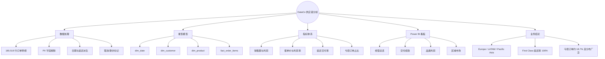
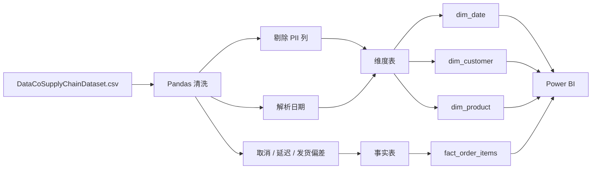
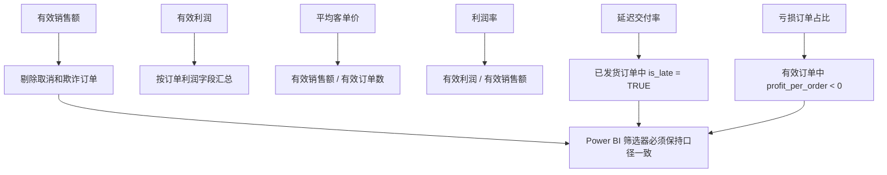
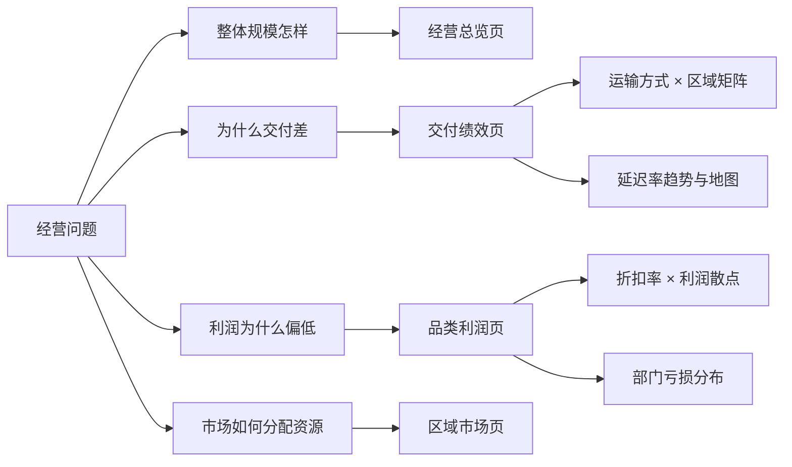
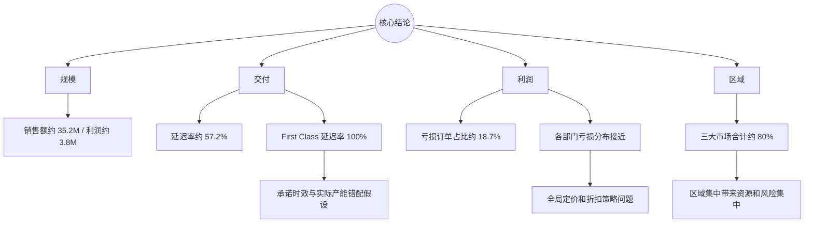

# 项目可视化与可解释性指南

本页用思维导图、数据流、指标树、业务决策树和现有看板截图解释 DataCo 项目的分析逻辑。图中的业务结果均来自仓库当前 README，原始数据需要在本地重新下载。

## 图 1：项目能力思维导图

## 图 2：ETL 与星型模型

`order_day` 使用纯日期与 `dim_date[date]` 关联，避免带时间的 datetime 无法命中日期维度。

## 图 3：指标口径与可解释性树

## 图 4：四页看板的业务决策树

## 图 5：核心结论与风险地图

## 既有看板截图

### 经营总览

解释：用于观察销售额、利润、客户结构和市场分布，是后续页面的总体基线。

### 交付绩效

解释：这是核心业务故事页，展示运输方式与延迟率的关系以及区域/时间维度下的履约差异。

### 品类与利润

解释：通过分解树和散点图定位亏损品类，用于验证“亏损是否集中在单一部门”的假设。

### 区域市场

解释：展示三大市场的收入贡献和区域分布，为资源分配与市场策略提供依据。

## 视觉阅读顺序

1. 图 1 先确认数据、模型、指标和看板模块。
2. 图 2 理解 ETL 与星型模型。
3. 图 3 解释每个指标的过滤口径。
4. 图 4 看清四页看板如何对应经营问题。
5. 图 5 和四张截图用于解释结论、风险与业务行动建议。